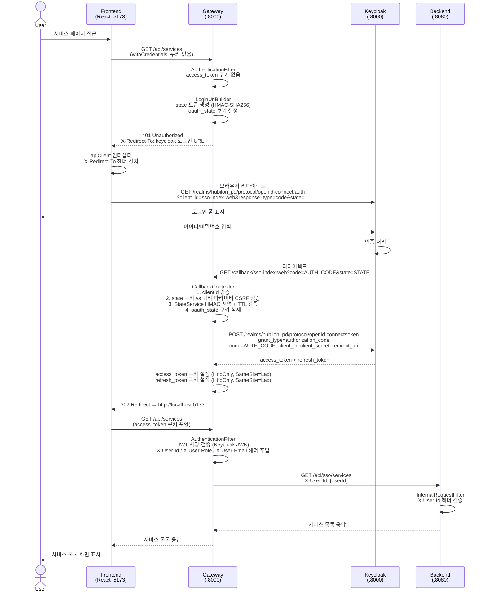
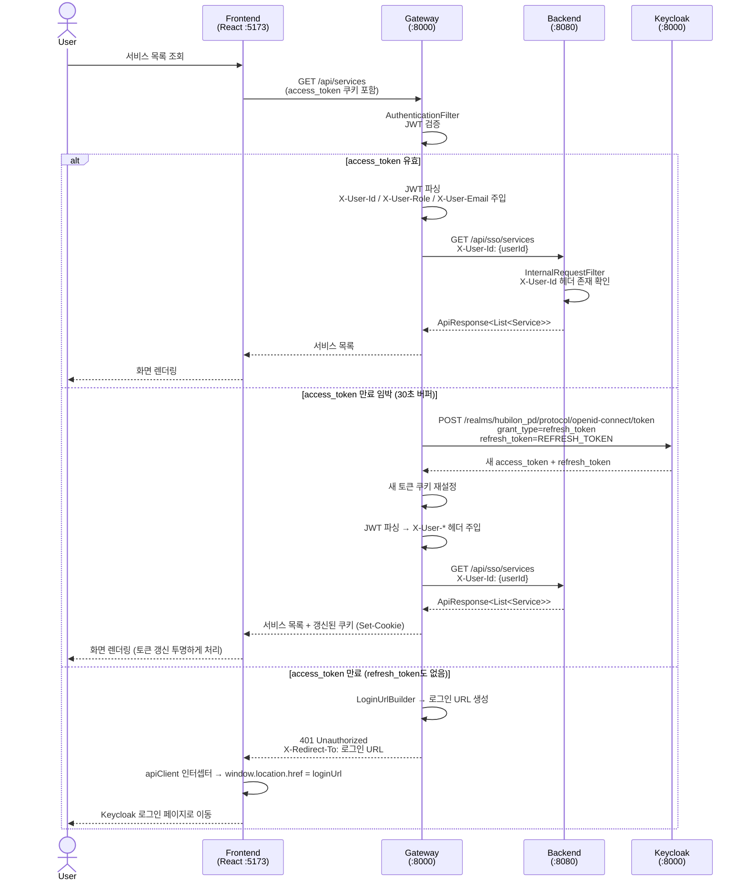

# SSO 시퀀스 다이어그램

## 1. 로그인 흐름



---

## 2. 서비스 API 호출 흐름 (인증 완료 상태)



---

## 3. 로그아웃 흐름

```mermaid
sequenceDiagram
    actor User
    participant FE as Frontend<br/>(React :5173)
    participant GW as Gateway<br/>(:8000)
    participant KC as Keycloak<br/>(:8000)

    User->>FE: 로그아웃 버튼 클릭
    FE->>FE: useAuth.logout() 호출

    FE->>GW: POST /api/logout<br/>(refresh_token 쿠키 포함)

    GW->>GW: LogoutController<br/>1. access_token 쿠키 삭제 (maxAge=0)<br/>2. refresh_token 쿠키 삭제 (maxAge=0)

    alt refresh_token 쿠키 존재
        GW->>KC: POST /realms/hubilon_pd/protocol/openid-connect/logout<br/>client_id, client_secret, refresh_token
        KC-->>GW: 204 No Content (세션 종료)
        GW->>GW: loginUrl 생성
    else refresh_token 없음
        GW->>GW: loginUrl 생성 (&prompt=login 추가)
    end

    GW-->>FE: 200 OK<br/>{ "loginUrl": "https://keycloak/.../auth?..." }<br/>Set-Cookie: access_token=; maxAge=0<br/>Set-Cookie: refresh_token=; maxAge=0

    FE->>FE: authStore.setAuthenticated(false)
    FE->>FE: isSafeRedirectUrl(loginUrl) 검증
    FE->>KC: 브라우저 리다이렉트 → loginUrl
    KC-->>User: Keycloak 로그인 페이지 표시
```

---

## 4. 포트 및 URL 매핑 요약

| 구간 | 요청 | 변환 |
|------|------|------|
| FE → Vite Proxy | `GET /api/services` | → `GET http://localhost:8000/api/sso/services` |
| FE → Vite Proxy | `POST /api/logout` | → `POST http://localhost:8000/api/logout` |
| GW → BE | `GET /api/sso/services` | → `GET http://localhost:8080/api/services` (RewritePath) |
| GW → KC (로그인) | Authorization Endpoint | `GET http://localhost:8000/realms/hubilon_pd/protocol/openid-connect/auth` |
| GW → KC (토큰) | Token Endpoint | `POST http://localhost:8000/realms/hubilon_pd/protocol/openid-connect/token` |
| GW → KC (로그아웃) | Logout Endpoint | `POST http://localhost:8000/realms/hubilon_pd/protocol/openid-connect/logout` |

## 5. 쿠키/헤더 흐름 요약

```
[FE → GW]
  Cookie: access_token=JWT, refresh_token=REFRESH_JWT

[GW → BE]
  Header: X-User-Id: {sub}
  Header: X-User-Role: {realm_access.roles[0]}
  Header: X-User-Email: {email}

[GW → FE (로그인 성공)]
  Set-Cookie: access_token=JWT; HttpOnly; SameSite=Lax; Path=/
  Set-Cookie: refresh_token=REFRESH_JWT; HttpOnly; SameSite=Lax; Path=/

[GW → FE (비인증)]
  Status: 401
  Header: X-Redirect-To: https://keycloak/auth?...
```
